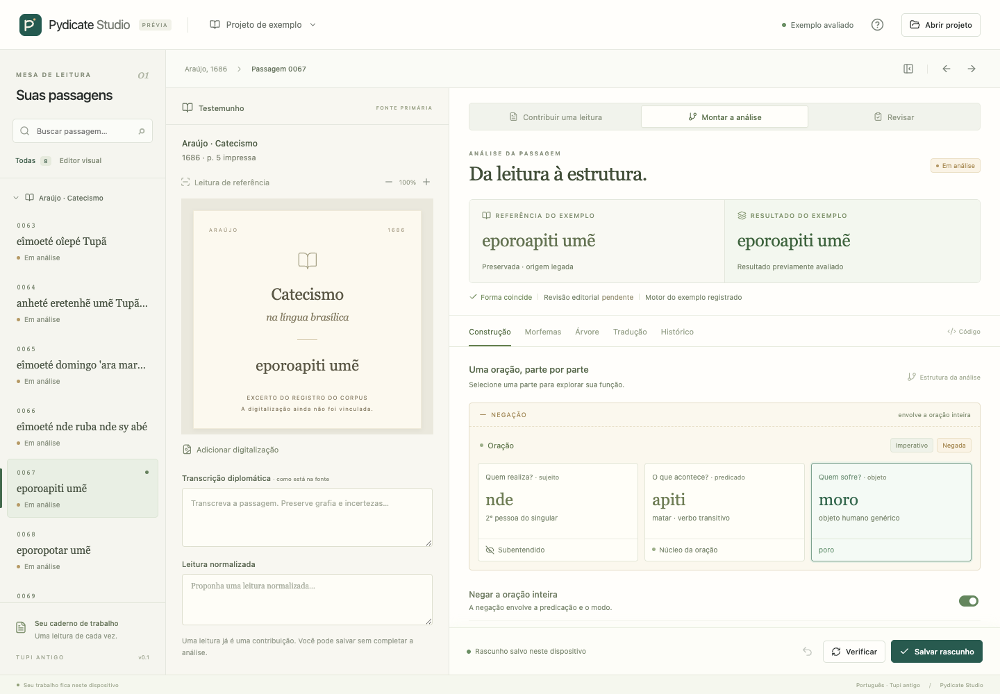

# Pydicate Studio

A Portuguese reading and authoring desk for Old Tupi. Start with a passage, save a reading or note, and inspect a small Pydicate construction without writing Python.

This initial Electron + React application implements part of stages 0–2 in the [design brief](docs/design/pydicate-studio-design.md). It includes a working Araújo 0067 editor, independent drafts, and read-only local corpus inspection. Full visual authoring, source write-back, editorial approval, a managed contributor installation, and integrated AI are future work. See the [implementation boundaries](docs/design/implementation-scope.md) and [operation inventory](docs/design/operation-inventory.md).



## Run the desktop

Use Node.js 22.12+ (Node 24 is used in CI), npm, Git, and Python 3.10+ for the worker. Live engine compatibility was observed with CPython 3.14.4; a bundled Python runtime is not supplied.

```sh
npm ci
npm run desktop
```

The application opens the included example immediately. Choose **Abrir projeto → Abrir projeto existente** to select a parent directory containing these existing clones:

```text
workspace/
├── pydicate-studio/
├── oldtupicorpus/
│   └── historic/
└── nhe-enga/
    ├── pydicate/
    └── tupi/
```

The Python worker reads the corpus and imports the selected engine for the supported construction. Set `PYDICATE_PYTHON` to an executable path when using a prepared environment. The Studio does not clone, install, update, or modify these neighboring repositories.

For the compiled desktop, run `npm run build` followed by `npm start`. No installer is produced yet.

## Explore in a browser

```sh
npm run dev
```

Open the local address printed by Vite. Browser mode uses eight real Araújo excerpts and previously evaluated engine snapshots for 0067. It supports readings, notes, authoring controls, undo, navigation, and local draft persistence. Live repository access and live Python evaluation require the desktop.

## Try a contribution

1. Open passage **0067**. Compare the saved reference with the current result.
2. Uncheck **Negar a oração inteira**. The result becomes `eporoapiti`; the reference remains `eporoapiti umẽ`. Use **Desfazer** to restore the draft.
3. Inspect **Morfemas**, **Árvore**, and **Código**. Selecting `poro` follows the generic object across views.
4. Add a diplomatic reading, normalized reading, translation, or note. Save before completing an analysis if useful.
5. Open **Revisar → Exportar contribuição** to download the selected draft with its source, reference, and evaluation provenance.

Local images and PDFs can be attached for consultation with zoom and PDF page controls. These attachments and page choices last only for the session; the reference card is explicitly labeled as a corpus excerpt, not a scan.

Desktop drafts live under Electron's application data directory. Browser drafts use that browser origin's `localStorage`. Clearing application/browser data removes those copies; contribution export provides a separate JSON artifact. Drafts never overwrite `.tu.py` files or accepted references, and matching a reference never creates approval.

## Checks

```sh
npm run check
npm run test:e2e
```

`check` verifies formatting, builds the app, and runs TypeScript-domain, desktop-service, and Python-adapter tests. Use `npm run format` after editing frontend or desktop code. The esbuild override keeps the Vite 7 toolchain on the patched 0.28.1 release. Browser tests use the channel configured in `playwright.config.ts`; see the CI workflow for browser installation. After a build, `node scripts/smoke-desktop.mjs` exercises the compiled Electron app with temporary application data. Add a parent-folder argument to include live corpus opening and Python evaluation.

The [compatibility record](docs/design/compatibility.local.json) describes the local engine/corpus contents used to evaluate the eight included render snapshots. Both repositories had uncommitted changes. Their recorded HEADs alone do **not** reproduce that environment, and this record is not a clean installation lock or a claim that the entire corpus executes successfully.

For code navigation, start with [the agent index](docs/agent/index.md), [desktop boundary](electron/README.md), and [Python service](python/README.md). Example text provenance and upstream licensing are recorded in [fixture attribution](src/domain/fixtures-attribution.md).
